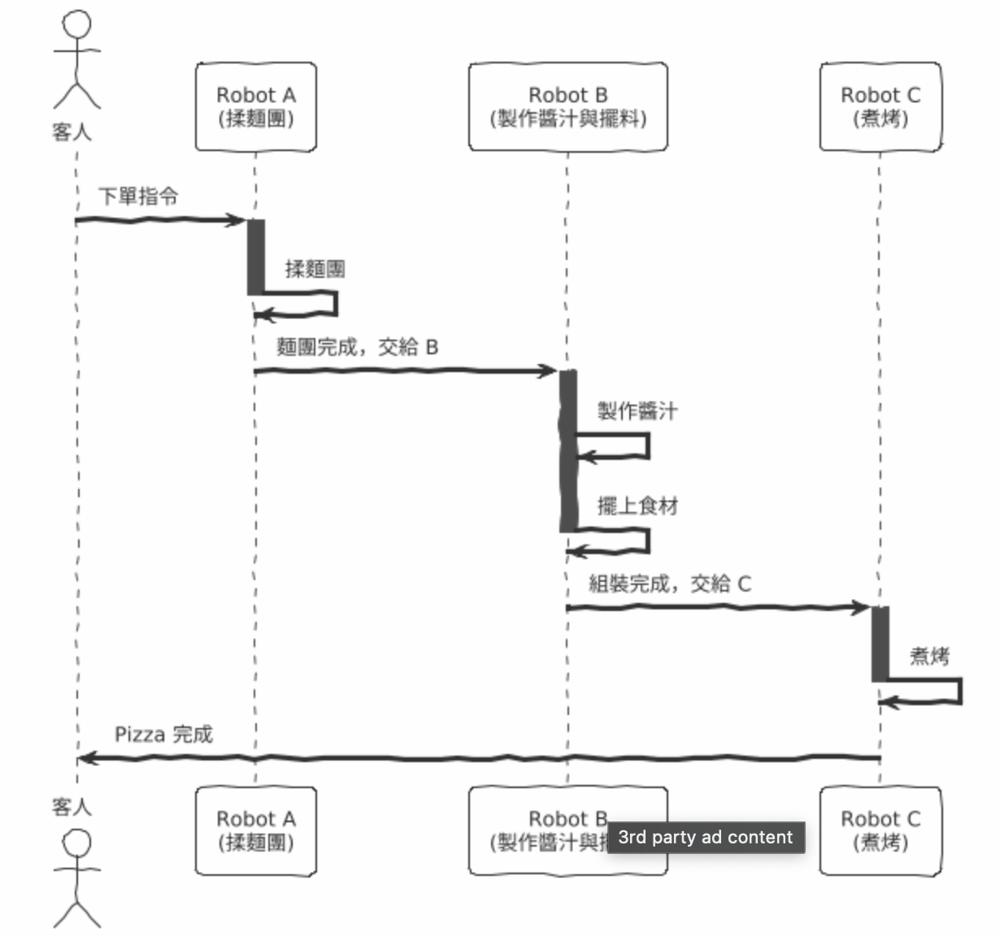
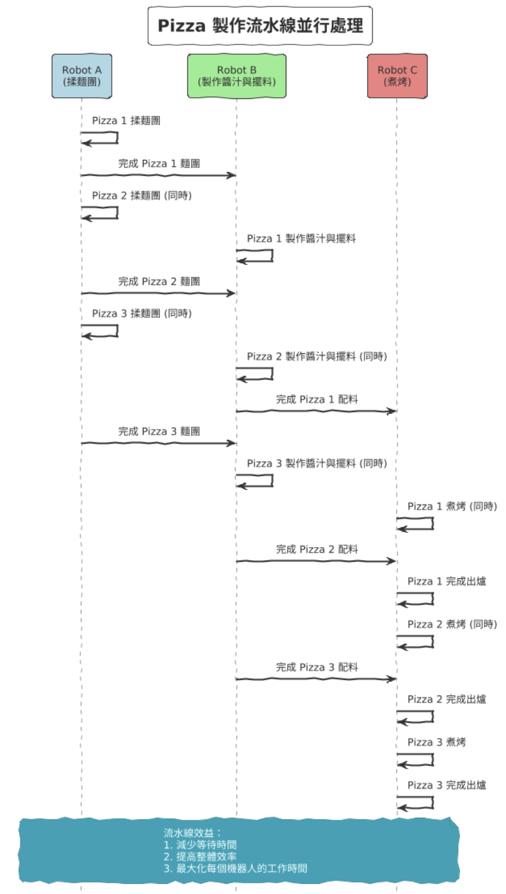

# 導論

---

## 第 1 章 初識函數式程式概念

### 集中式系統 vs 分散式系統

| 集中式系統         | 分散式系統         |
| ------------------ | ------------------ |
| 資料保存在一個地方 | 資料分散在多個地方 |
| 資料同步容易       | 資料同步困難       |
| 資料一致性容易維護 | 資料一致性維護困難 |

### Functional Programming 的定義

> "函數式程式設計是一種程式設計風格，其中函數被視為第一等公民，並使用高階函數來從現有函數組合成新的函數。"

- Action（動作、操作或行為）=> Impure Function

  - 會隨著時間改變

- Calculations（計算、運算）=> Pure Function

  - 輸入相同、輸出相同
  - 計算或是決策有關，不會與環境互動
  - 適合用來測試
  - 例如：測試、計算

- Data（數據、資料）
  - 事件或是事實紀錄
  - 養成長期保留的習慣
  - 例如：資料庫、文件、檔案

## 第 2 章 實務中的函數式思維

### 分層設計

| 改變頻率 | 階層     | 餐廳                     | 庫存層     |
| -------- | -------- | ------------------------ | ---------- |
| 高       | 業務邏輯 | 本週菜單：當周特餐的食譜 | 本週採購   |
| 中       | 領域層   | 比薩製作：食譜的內容     | 原料清單   |
| 低       | 技術層   | Javascript               | Javascript |

### 頭等抽象化

> 假如現在餐廳有一個製作比薩的流程，我們可以將這個流程抽象化，


<details>
<summary>PlantUML</summary>

```
@startuml
start

:客人點餐;
:揉麵團;
:製作醬汁;
:擺上食材;
:煮烤;
:完成;

stop
@enduml

```

</details>

### 頭等抽象化的瓶頸

> 假如現在有三個機器人，每個機器人負責不同的工作，



<details>
<summary>PlantUML</summary>

```
@startuml
!theme sketchy-outline
actor 客人
participant "Robot A\n(揉麵團)" as A
participant "Robot B\n(製作醬汁與擺料)" as B
participant "Robot C\n(煮烤)" as C

客人 -> A : 下單指令
activate A
A -> A : 揉麵團
deactivate A

A -> B : 麵團完成，交給 B
activate B
B -> B : 製作醬汁
B -> B : 擺上食材
deactivate B

B -> C : 組裝完成，交給 C
activate C
C -> C : 煮烤
deactivate C

C -> 客人 : Pizza 完成
@enduml
```

</details>

如果沒有特別調整時間線，則會遇到需要互相等待的情況

---

當然，我們可以調整時間線，讓每個機器人可以同時工作
或是思考各式的解決方案，例如：



<details>
<summary>PlantUML</summary>

```
@startuml
hide footbox
skinparam sequenceMessageAlign center
skinparam sequenceArrowThickness 2
skinparam sequenceArrowColor #333333
skinparam sequenceGroupBackgroundColor #F8F8F8
skinparam sequenceGroupBorderColor #CCCCCC
skinparam sequenceLifeLineBorderColor #999999

title Pizza 製作流水線並行處理

participant "Robot A\n(揉麵團)" as A #LightBlue
participant "Robot B\n(製作醬汁與擺料)" as B #LightGreen
participant "Robot C\n(煮烤)" as C #LightCoral

' Pizza 1 製作流程
A -> A: Pizza 1 揉麵團
A -> B: 完成 Pizza 1 麵團

' Pizza 2 製作流程，Robot A 可以立即開始下一份
A -> A: Pizza 2 揉麵團 (同時)
B -> B: Pizza 1 製作醬汁與擺料
A -> B: 完成 Pizza 2 麵團

' Pizza 3 製作流程，繼續並行
A -> A: Pizza 3 揉麵團 (同時)
B -> B: Pizza 2 製作醬汁與擺料 (同時)
B -> C: 完成 Pizza 1 配料

' 繼續流水線
A -> B: 完成 Pizza 3 麵團
B -> B: Pizza 3 製作醬汁與擺料 (同時)
C -> C: Pizza 1 煮烤 (同時)
B -> C: 完成 Pizza 2 配料

' 最後階段
C -> C: Pizza 1 完成出爐
C -> C: Pizza 2 煮烤 (同時)
B -> C: 完成 Pizza 3 配料

C -> C: Pizza 2 完成出爐
C -> C: Pizza 3 煮烤

C -> C: Pizza 3 完成出爐

note over A, C
  流水線效益：
  1. 減少等待時間
  2. 提高整體效率
  3. 最大化每個機器人的工作時間
end note

@enduml
```

</details>
