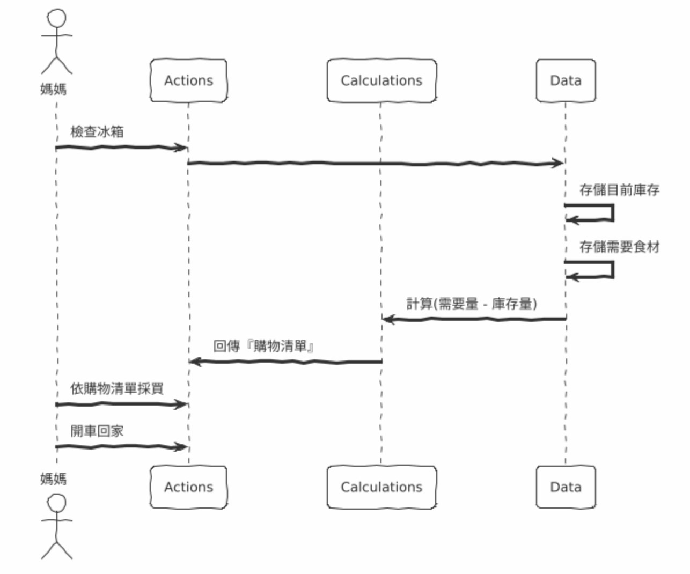

# 如何分辨 Actions、Calculations 與 Data

---

## 第 3 章 分辨 Actions、Calculations 與 Data(56)

| Actions                                       | Calculations           | Data                     |
| --------------------------------------------- | ---------------------- | ------------------------ |
| 會產生 Side Effect ，且受到執行時間或次數限制 | 透過運算將輸入轉為輸出 | 關於各事件的紀錄         |
| 也稱為額外作用函數、非純函數                  | 也稱為純函數、數學函數 |                          |
| 例子：傳送電子郵件                            | 例子：計算面積         | 例子：記錄使用者的 Email |

### 生活中的 ACD



<details>
<summary>PlantUML</summary>

```
@startuml
!theme sketchy-outline
actor 媽媽
participant "Actions" as A
participant "Calculations" as B
participant "Data" as C

' 行動步驟
媽媽 -> A: 檢查冰箱
A -> C:
C -> C: 存儲目前庫存
C -> C: 存儲需要食材
C -> B: 計算(需要量 - 庫存量)
B -> A: 回傳『購物清單』
媽媽 -> A: 依購物清單採買
媽媽 -> A: 開車回家
@enduml
```

</details>

## 第 4 章 Action 的優化策略

### 章節目標

Action 的優化策略

### 背景介紹

MagaMart 是一家網路超市，其最具競爭力的特色之一是：網站頁面會顯示目前購物車中的所有商品，以及購物車中的總金額。即便消費者仍在購物中，也能隨時了解消費者的購物情況。

### Task

#### Phase 1

- /ch4-1 這個分支包含了 4-1 ~ 4-3 的程式碼

**TODO**

- [] 指出這段程式碼哪些是 Action、Calculations、Data
